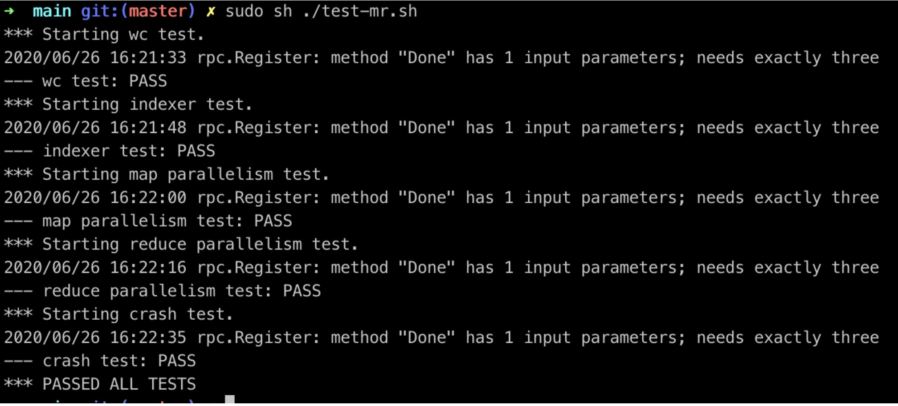

# lab1 MapReduce

[TOC]

## Test

Passed all tests.




## System Design

Master Workflow:

* Master 上线，并且输入中有要处理的文件名，遍历所有的文件名，初始化 MapTasks
* Master Server 启动，等待 Worker 上线并且请求任务
* 给请求任务的 worker 分配 Map Task
* 如果在指定时间内（10s）内完成，该 MapTask 任务完成，否则重置该任务的状态并且分配给另外请求的 worker
* 等待所有 Map Task 完成
* 根据用户输入 nReduce，将 Map Task 生成的中间文件分成 n 个文件，并且初始化 n 个 Reduce Task
* 给请求任务的 worker 分配 Reduce Task
* 如果在指定时间内（10s）内完成，该 Reduce Task 任务完成，否则重置该任务的状态并且分配给另外请求的 worker
* 等待所有 Reduce Task 完成
* 给每个工作的 worker 发送消息，可以退出工作

Worker Workflow：

* Worker 上线，每隔 1s 通过 RPC 调用向 Master 请求任务，有四种情况
  * 如果没有任务，等待
  * 收到 Master 分配的 Map Task，其中包含该 Map Task 要处理的文件名和 Map Task ID，完成 Map Task 之后将中间文件名发送给 Master
  * 收到 Master 分配的 Reduce Task，其中包含该 Reduce Task 要处理的文件名和 Reduce Task ID，完成 Reduce Task 之后将中间文件名发送给 Master
  * 收到 关闭信号，此时退出

## Details && Points

机制：

* Master 与 Worker 沟通：go RPC
* 中间文件存储：json
* 同步消息传递：go channel
* 锁：sync.Mutex


### 超时任务机制

这个任务需要有两个问题需要处理：

1. 如果一个任务超时，需要将这个任务重新分配给另一个 Worker
2. 如果经过很长时间，收到原来的 Worker 发来的消息，此时原来的消息需要抛弃

解决方法：

1. 通过 `select` 机制与 `time.Wait()`，在每个任务分配给 Worker 之后，开启一个 `goroutine` 来进行定时，如果超过时间，那么修改这个任务的状态为 `IDLE`,等待被分配，可以再次被分配
2. 给每个 task 设定一个 taskID（**类似于时间戳**），并且在分配任务的时候告诉给 Worker，发送完成消息的时候需要携带该信息，如果当前任务超时，那么将原来的 taskID 增加，每当Master 收到任务完成的消息之后，比较当前任务的 taskID，
   * 如果消息中携带的 taskID 等于该任务的 taskID，那么说明该任务在指定时间内完成
   * 如果消息中携带的 taskID 小于该任务的 taskID，那么说明该任务已经被分配给了一个新的任务，此时就抛弃该消息


### 请求任务

master：

master 有一个分配任务的 RPC 接口，每次有请求任务的时候，需要判断是否可以开始分配 Map 任务，如果 Map 任务全部结束，那么开始分配 Reduce 任务，如果所有的 Reduce 任务全部结束，那么就可以让每个 Worker 关闭


worker：

每个 Worker 只有一个通用的请求任务接口，在收到 Master 回复之前 Worker 并不知道自己会做什么工作，而 Master 会告诉 Worker 需要做的事情，通过在回复中指定任务类型与需要处理的任务 ID


### 将中间值划分为 n buckets

当所有 Map Task 完成之后，需要 Master 此时去将所有的 Map 生成的中间文件整理成 n 个 buckets，此时不向外分配任务。

此时需要将所有的中间文件读取，并且尽可能均分成 n buckets，此时需要注意一个点，那就是**具有相同 Key 的 KV 应该被分配到同一个 reduce 任务**，这个时候需要在均分的时候，检查当前均分的最后是否包含了当前 Key 的所有值，如果不包含，就需要增加末尾值直到当前末尾值都放到了同一个 bucket 中。

然后将每个 bucket 中的 kv 值存储到临时的 json 文件中，并且初始化 reduce 任务（包含这些中间文件名）。


## Run

由于 MapReduce 加载 mr apps 是采用运行时动态加载的方式，所以需要将 mr app 先编译，然后再运行 master 和 worker，这里以 wc app 为例。


```shell
$ go build -buildmode=plugin ../mrapps/wc.go	# 构建.so 文件

$ go run mrmaster.go pg-*.txt

$ go run mrworker.go wc.so	# 可以启动一个或者多个 worker 进程
```

